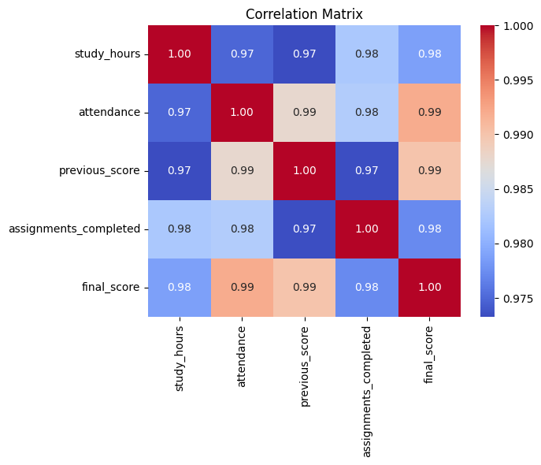
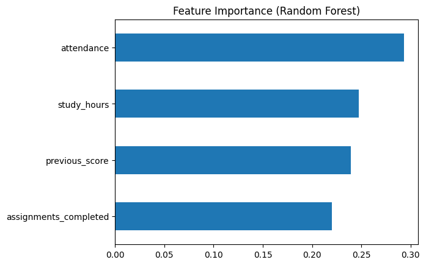
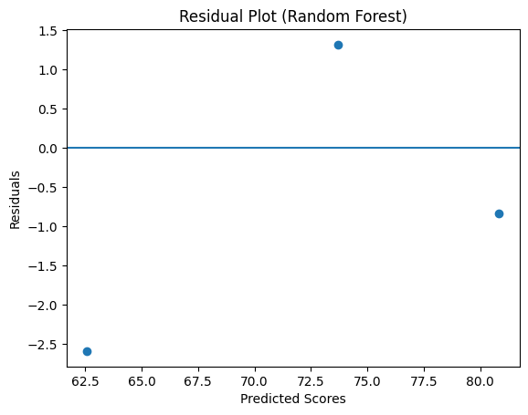

# 📊 Student Performance Prediction using Machine Learning

## 📌 Overview
This project implements an end-to-end regression pipeline to predict student academic performance using structured educational data.

The workflow includes data analysis, model comparison, cross-validation, and residual analysis.

---

## 🛠️ Tech Stack
- Python
- Pandas
- NumPy
- Scikit-learn
- Matplotlib
- Seaborn

---

## 🔍 Workflow
1. Data Loading & Exploration
2. Correlation Analysis
3. Train-Test Split
4. Model Training
   - Linear Regression
   - Random Forest Regressor
5. Model Evaluation (MAE, R²)
6. 5-Fold Cross Validation
7. Feature Importance Analysis
8. Residual Analysis

---

## 📈 Model Performance

### Linear Regression
- MAE: 2.45
- R² Score: 0.91

### Random Forest
- MAE: 1.58
- R² Score: 0.95

Random Forest demonstrated improved predictive performance and generalization.

---

## 📊 Visualizations

### Correlation Matrix

### Feature Importance

### Actual vs Predicted

### Residual Plot

---

## 🎯 Key Insights
- Study hours and previous scores strongly influence final performance.
- Ensemble methods outperform linear models in capturing non-linear relationships.
- Cross-validation confirms model stability.

---

## 🚀 Future Improvements
- Hyperparameter tuning
- Larger real-world dataset
- Deployment using Streamlit
